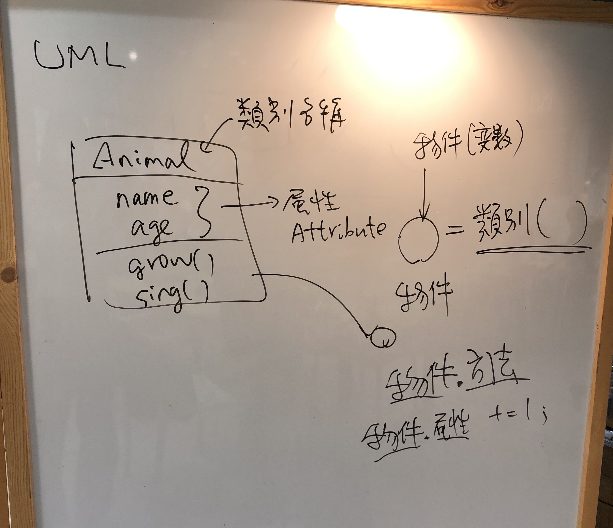
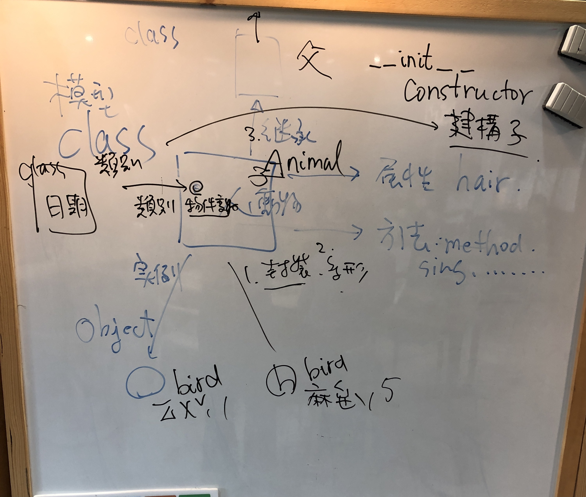
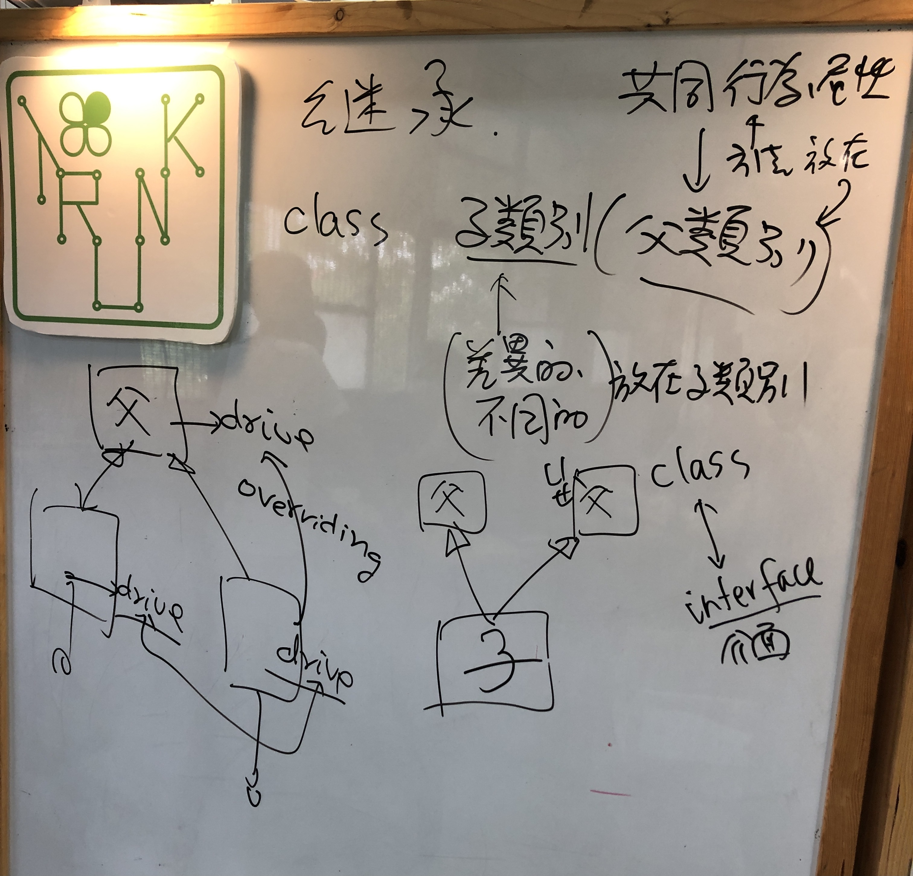

# B_1_Python物件導向程式設計

## 物件導向程式設計範例
```
class Animal():      #定義類別  
    def __init__(self, name,age):
        self.name = name  #定義屬性 
        self.age = age
        print("正在產生物件")
        print(self.name + str(self.age) + "歲，很會唱歌!")
    def sing(self):       #定義方法        
        print(self.name + str(self.age) + "歲，很會唱歌!")  
    def grow(self,year):  #定義方法        
        self.age += year     
        
bird = Animal("鸚鵡",1) #以 Animal 類別，建立一個名叫鸚鵡、1歲大的 bird物件
bird.grow(11)     #長大1歲
bird.sing()      #鸚鵡2歲，很會唱歌!
```




## 類別(Class)與物件(object)
```
class Animal():      #定義類別  
    def __init__(self, name,age):
        self.name = name 
        self.age = age
        print("正在產生物件")
        print(self.name + str(self.age) + "歲，很會唱歌!")

    def sing(self):
        print(self.name + str(self.age) + "歲，很會唱歌!") 
 
    def grow(self,year):
        self.age += year     
        
bird = Animal("鸚鵡",1) 
bird.grow(11) 
bird.sing()

dog = Animal("狗狗",111) 
dog.grow(11)     
dog.sing() 
```

# 物件導向程式設計核心觀念:封裝繼承與多形


## 封裝(Encapsulation)
```
將物件內部的資料隱藏起來，只能透過物件本身所提供的介面(interface)取得物件內部屬性或者方法，物件內部的細節資料或者邏輯則隱藏起來，
其他物件即無法瞭解此物件的內部細節，若不經過允許之窗口(即此物件提供之方法)便無從更動此物件內之資料。

簡白的說，對一件事情只需要理解他的外在就好，不需要了解裡面內部的構造。
```
```
封裝在類別的PRIVATE屬性與方法
使用 __name 定義PRIVATE屬性
使用__sing(self)定義私用PRIVATE方法  
```
```
class Animal():      #定義類別  
    def __init__(self, name,age):
        self.__name = name  #
        self.__age = age
    def __sing(self):               
        print(self.__name + str(self.__age),end= "歲，很會唱歌，")  
    def talk(self):        #定義PUBLIC方法 
        self.__sing()      #使用PRIVATE方法
        print("也會模仿人類說話!")
        
bird = Animal("灰鸚鵡",2) #以 Animal 類別，建立一個名叫灰鸚鵡、2歲大的 bird物件
bird.talk()       #灰鸚鵡2歲，很會唱歌，也會模仿人類說話!

bird.__age = -1  #設定無效
bird.talk()      #灰鸚鵡2歲，很會唱歌，也會模仿人類說話!
#bird.__sing()   #執行出現錯誤
```
# 繼承(Inheritance)
```
資料來源
https://www.learncodewithmike.com/2020/01/python-inheritance.html
```

```
有父類別(或稱基底類別Base Class)及子類別(Sub Class)的階層關係。
子類別會擁有父類別公開的屬性(Attribute)及方法(Method)。

Python繼承(Inheritance)的概念就是將各類別(Class)會共同使用的屬性(Attribute)或方法(Method)放在一個獨立的類別(Class)中，
其它的類別(Class)透過繼承(Inheritance)的方式來擁有，降低程式碼的重複性。
```



### 不具reusable程式
```
# 汽車類別
class Car:
    # 駕駛方法
    def drive(self):
        print("drive method is called.")
    # 加速方法
    def accelerate(self):
        print("accelerate method is called.")

# 飛機類別
class Airplane:
    # 駕駛方法
    def drive(self):
        print("drive method is called.")
    # 飛行方法
    def fly(self):
        print("fly method is called.")
```

### 改成reusable程式
```
將共同的屬性(Attribute)或方法(Method)定義在一個父類別(Class)中，
而其它子類別(Class)則透過繼承(Inheritance)的方式來擁有它
```
```
# 交通工具(基底類別)
class Transportation:
    # 建構式
    def __init__(self):
        self.color = "white"  #顏色屬性
    # 駕駛方法
    def drive(self):
        print("drive method is called.")

# 汽車子類別
class Car(Transportation):
    # 加速方法
    def accelerate(self):
        print("accelerate is method called.")

# 飛機子類別
class Airplane(Transportation):
    # 飛行方法
    def fly(self):
        print("fly method is called.")

mazda = Car()
mazda.drive()
print(mazda.color)
```
```
Transportation類別(Class)就叫父類別或基底類別(Base Class)
Car及Airplane類別(Class)就稱為子類別(Sub Class)

在類別名稱的地方透過括號的方式來繼承(Inheritance)，藉此擁有父類別公開的屬性(Attribute)及方法(Method)
```

### 使用issubclass()方法來判斷類別(Class)之間是否具有關係
```
# Airplane是否為Transportation的子類別
print(issubclass(Airplane, Transportation))  # True

# Airplane是否為object的子類別
print(issubclass(Airplane, object))  # True

# Airplane是否為Car的子類別
print(issubclass(Airplane, Car))  # Fasle
```

### 使用super()來執行父類別的方法(Method)
```
要在子類別中執行父類別的方法(Method)時，可以使用super()內建方法來達成
```
```
# 交通工具(父類別  基底類別Base class )
class Transportation:
    # 駕駛方法
    def drive(self):
        print("父類別 drive method is called.")
        
# 汽車子類別
class Car(Transportation):
    # 駕駛方法
    def drive(self):
        super().drive()
        print("Sub class drive method is called.")

mazda = Car()
mazda.drive()
```
```
mazda.drive()執行:
   先執行super().drive()==>先叫聲爸爸好
   然後再執行 print("Sub class drive method is called.")==>兒子更優秀
```
```
overwrite:複寫
父類別的方法被子類別複寫
兒子很爭氣走出自己的風格
```
### 多層繼承(Multi-Level Inheritance)
```
# 動物類別
class Animal:
    pass
    
# 鳥類類別
class Bird(Animal):
    # 飛行方法
    def fly(self):
        print("fly")

# 鴨子類別
class Duck(Bird):
    pass
    
duck = Duck()
duck.fly()
```

### 多重繼承(Multiple Inheritance)
```
子類別繼承(Inheritance)一個以上的父類別
如果沒有適當的使用同樣會產生問題
```
#### OK
```
# 動物類別
class Animal:
    def eat(self):
        print("Animal eat method is called.")

# 鳥類類別
class Bird:
    def walk(self):
        print("Bird walk method is called.")

# 鴨子類別
class Duck(Animal, Bird):
    pass

duck = Duck()
duck.eat()
```

#### 容易出問題
```
Python編譯器在執行多重繼承(Multiple Inheritance)時，會先檢查類別本身[Duck類別]是否有eat()方法(Method)
如果沒有，接著Python編譯器會尋找多重繼承(Multiple Inheritance)的第一個父類別Animal是否擁有，有的話即執行，並且停止搜尋第二個類別。
先繼承的先執行
```
```
# 動物類別
class Animal:
    def eat(self):
        print("Animal eat method is called.")

# 鳥類類別
class Bird:
    def eat(self):
        print("Bird fly method is called.")

# 鴨子類別
class Duck(Animal, Bird): ## Animal在前
    pass
duck = Duck()
duck.eat()
```

```
# 動物類別
class Animal:
    def eat(self):
        print("Animal eat method is called.")

# 鳥類類別
class Bird:
    def eat(self):
        print("Bird fly method is called.")

# 鴨子類別
class Duck(Bird,Animal): ## Bird在前
    pass
    
duck = Duck()
duck.eat()
```
## 多型(Polymorphism)



```
資料來源
https://medium.com/w-learning-note/%E4%BB%80%E9%BA%BC%E6%98%AF%E7%89%A9%E4%BB%B6%E5%B0%8E%E5%90%91%E4%B8%AD%E7%9A%84%E5%B0%81%E8%A3%9D-%E7%B9%BC%E6%89%BF%E5%92%8C%E5%A4%9A%E5%9E%8B%E7%89%B9%E6%80%A7-c15d4e8c567a
```
```
簡單來說就是相同名稱的方法(Method)，多個相同名稱的方法，傳入不同的參數，會執行不同的敘述。

多型(Polymorphism)則包含多載(Overloading)和複寫(Overriding)。

多載(Overloading) — 是指說在相同類別中，定義名稱相同，但是參數個數不同，或是參數型態不同的函式，這樣就可以利用參數個數或者參數型態，呼叫到對應的方法。

例如：一個計算面積的方法，如果傳入一個參數，就當正方形來算面積；傳入兩個參數，就當成長方形來算面積。

複寫(Overriding) — 是指覆寫掉父類別中的函式。
```
## 複寫(Overriding):覆寫掉父類別中的函式。
```
兒子重新定義老子  所謂的光榮
```
```
# 交通工具(基底類別)
class Transportation:
    # 駕駛方法
    def drive(self):
        print("Base class drive method is called.")
        
# 汽車子類別
class Car(Transportation):
    # 駕駛方法
    def drive(self):
        print("Car drive method is called.")
        
# 飛機類別
class Airplane(Transportation):
    # 駕駛方法
    def drive(self):
        print("Airplane drive method is called.")
        
haha = Transportation()     
haha.drive()

mazda = Car()
mazda.drive()

airplane = Airplane()
airplane.drive()
```
##
```
資料來源
https://www.learncodewithmike.com/2020/01/python-polymorphism.html
```
```
from abc import ABC, abstractmethod

# 登入抽象類別
class Login(ABC):
    @abstractmethod
    def login(self):
        pass

# Facebook登入機制
class FacebookLogin(Login):
    def login(self):
        print("Facebook login implementation.")

#Google登入機制
class GoogleLogin(Login):
    def login(self):
        print("Google login implementation.")

#Twitter登入機制
class TwitterLogin(Login):
    def login(self):
        print("Twitter login implementation.")


fb = FacebookLogin()
fb.login()

google = GoogleLogin()
google.login()

twitter = TwitterLogin()
twitter.login()
```
```
來源端不同的類別物件(Object)呼叫同樣的方法(Method)時，卻可以有不同的實作方式，這也就是所謂的多型(Polymorphism)。

原理:Python編譯器在執行期間(Runtime)看到三個實體類別(Class)皆繼承(Inheritance)了Login抽象類別，
接著在物件(Object)呼叫login()方法(Method)時，Python編譯器則依據呼叫物件(Object)的實體類別(Class)來執行相應的類別實作。
```
